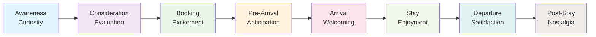
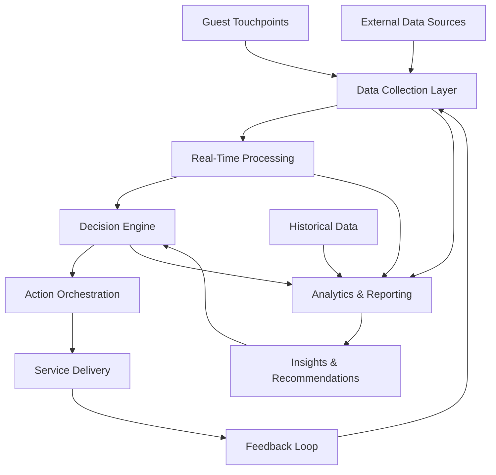

# Customer Journey Mapping for Hotel Operations

## Overview

Customer Journey Mapping is a strategic tool that visualizes the complete guest experience from initial awareness through post-stay engagement. This comprehensive mapping identifies touchpoints, pain points, and opportunities for enhancement across all stages of the guest lifecycle.

## Journey Stages

### 1. Awareness & Discovery
**Objective:** Attract potential guests and create interest in the property

#### Touchpoints:
- Online travel agencies (OTAs)
- Hotel website and social media
- Search engines and travel blogs
- Word-of-mouth referrals
- Traditional advertising (print, radio, TV)
- Influencer partnerships
- Travel exhibitions and events

#### Guest Activities:
- Researching destinations and accommodations
- Comparing prices and amenities
- Reading reviews and testimonials
- Viewing photos and virtual tours
- Seeking recommendations from friends/family

#### Emotions & Expectations:
- Curiosity about experiences
- Desire for value and quality
- Need for reassurance through reviews
- Excitement about potential vacation

#### Hotel Actions:
- Maintain strong online presence with updated content
- Optimize for search engines (SEO)
- Showcase unique selling propositions
- Encourage and respond to reviews
- Provide comprehensive property information
- Offer virtual property tours

#### KPIs:
- Website traffic and engagement metrics
- Search engine rankings
- Social media reach and engagement
- Brand awareness surveys
- OTA performance metrics

### 2. Consideration & Evaluation
**Objective:** Influence booking decisions through compelling value propositions

#### Touchpoints:
- Detailed property website
- Booking engine comparison
- Price comparison tools
- Loyalty program information
- Special offers and packages
- Guest reviews and ratings
- Virtual concierge services

#### Guest Activities:
- Evaluating room types and rates
- Assessing included amenities
- Checking availability for dates
- Reviewing cancellation policies
- Comparing with competitive properties
- Considering loyalty benefits

#### Emotions & Expectations:
- Value consciousness
- Need for flexibility
- Desire for personalized experiences
- Concern about hidden costs
- Importance of trust and reliability

#### Hotel Actions:
- Transparent pricing with no hidden fees
- Flexible booking and cancellation options
- Personalized package recommendations
- Clear communication of policies
- Showcase unique amenities and services
- Highlight guest satisfaction scores

#### KPIs:
- Conversion rate from inquiry to booking
- Average booking value
- Package uptake rates
- Cart abandonment rates
- Guest satisfaction with booking process

### 3. Booking & Reservation
**Objective:** Ensure seamless reservation process with clear expectations

#### Touchpoints:
- Online booking engine
- Direct phone reservations
- Mobile app booking
- Travel agent bookings
- Corporate booking portals
- Confirmation emails and SMS

#### Guest Activities:
- Selecting dates and room types
- Providing guest information
- Choosing add-on services
- Entering payment details
- Reviewing and confirming reservation
- Receiving booking confirmation

#### Emotions & Expectations:
- Desire for simplicity and speed
- Need for transaction security
- Want confirmation and peace of mind
- Interest in pre-arrival customization
- Preference for multiple payment options

#### Hotel Actions:
- Streamlined booking process with minimal steps
- Secure payment processing
- Immediate confirmation with clear details
- Pre-arrival customization options
- Personalized upselling based on guest profile
- Integration with loyalty programs

#### KPIs:
- Booking completion rate
- Average time to complete booking
- Payment processing success rate
- Pre-arrival service uptake
- Guest satisfaction with booking experience

### 4. Pre-Arrival Experience
**Objective:** Build anticipation and prepare for personalized stay

#### Touchpoints:
- Pre-arrival communication
- Mobile app engagement
- Special request management
- Travel planning assistance
- Loyalty program communications
- Weather and local event notifications

#### Guest Activities:
- Receiving pre-arrival communications
- Customizing room preferences
- Planning activities and dining
- Downloading mobile app
- Setting up digital check-in
- Reviewing resort policies and amenities

#### Emotions & Expectations:
- Excitement and anticipation
- Desire for personalized experience
- Need for convenience and flexibility
- Want clear communication
- Preference for digital interactions

#### Hotel Actions:
- Personalized pre-arrival communications
- Mobile app onboarding and engagement
- Proactive special request fulfillment
- Local attraction and activity recommendations
- Weather-based amenity preparation
- Digital check-in enablement

#### KPIs:
- Pre-arrival communication open rates
- Mobile app download and activation
- Special request fulfillment rate
- Digital check-in adoption
- Guest satisfaction with pre-arrival experience

### 5. Arrival & Check-In
**Objective:** Create memorable first impression with efficient, welcoming service

#### Touchpoints:
- Airport transportation (if offered)
- Valet parking and greeter services
- Lobby and reception area
- Mobile check-in kiosks
- Guest relations team
- Concierge services
- Bell services and luggage handling

#### Guest Activities:
- Navigating to property
- Checking in and receiving room key
- Receiving welcome amenities
- Getting property orientation
- Meeting staff and learning about services
- Receiving luggage assistance

#### Emotions & Expectations:
- Desire for quick, efficient service
- Want warm, personalized welcome
- Need clear property orientation
- Expectation of promised amenities
- Appreciation for assistance with luggage
- Interest in property highlights and activities

#### Hotel Actions:
- Streamlined check-in processes
- Personalized welcome experiences
- Property orientation and amenity introduction
- Efficient luggage handling
- Introduction to special services and amenities
- Anticipatory service based on guest profile

#### KPIs:
- Average check-in time
- Guest satisfaction with arrival experience
- Welcome amenity acceptance rate
- Staff greeting and recognition rate
- Positive first impression scores

### 6. Stay Experience
**Objective:** Deliver consistently exceptional service exceeding expectations

#### Touchpoints:
- Guest room experience
- Dining venues and room service
- Spa and recreational facilities
- Concierge and activity bookings
- Housekeeping services
- Business center and meeting spaces
- Pool and beach areas
- Retail shops and boutiques

#### Guest Activities:
- Enjoying accommodation amenities
- Dining and culinary experiences
- Participating in activities and entertainment
- Utilizing spa and wellness services
- Exploring local attractions
- Conducting business meetings
- Shopping and retail therapy
- Relaxing by pool or beach

#### Emotions & Expectations:
- Desire for comfort and relaxation
- Want exceptional service quality
- Need personalized attention
- Expectation of cleanliness and maintenance
- Appreciation for convenience and flexibility
- Interest in memorable experiences

#### Hotel Actions:
- Proactive service delivery
- Anticipatory need fulfillment
- Personalized experience customization
- Consistent quality standards
- Prompt issue resolution
- Local experience recommendations
- Special occasion recognition

#### KPIs:
- Guest satisfaction scores
- Service recovery effectiveness
- Repeat service usage rates
- Positive incident reports
- Staff interaction quality scores
- Revenue per available guest

### 7. Departure & Check-Out
**Objective:** Ensure smooth, efficient departure with lasting positive impression

#### Touchpoints:
- Checkout process
- Bill presentation and review
- Feedback collection
- Farewell and thank you
- Transportation arrangements
- Loyalty program updates
- Follow-up communication

#### Guest Activities:
- Settling final bill
- Reviewing charges and receipts
- Providing feedback on experience
- Receiving departure assistance
- Planning future visits
- Sharing experiences on social media
- Updating contact information

#### Emotions & Expectations:
- Desire for quick, efficient checkout
- Want accurate billing with no surprises
- Need opportunity to provide feedback
- Appreciation for farewell gestures
- Interest in future communication
- Preference for digital receipt options

#### Hotel Actions:
- Streamlined checkout processes
- Accurate and transparent billing
- Proactive feedback collection
- Personalized farewell experiences
- Future visit incentive offers
- Contact information update requests
- Social media engagement encouragement

#### KPIs:
- Average checkout time
- Billing accuracy rate
- Feedback response rate
- Positive departure experience scores
- Future booking intention percentage
- Social media mention volume

### 8. Post-Stay Engagement
**Objective:** Maintain relationship and encourage repeat visits and referrals

#### Touchpoints:
- Thank you and feedback emails
- Loyalty program communications
- Special occasion recognition
- Anniversary and milestone celebrations
- Survey and review requests
- Social media engagement
- Referral program participation

#### Guest Activities:
- Receiving post-stay communications
- Providing detailed feedback
- Sharing experiences on review sites
- Engaging with social media posts
- Participating in loyalty programs
- Planning future visits
- Referring friends and family

#### Emotions & Expectations:
- Appreciation for memorable experience
- Desire to share positive experiences
- Want continued relationship nurturing
- Interest in loyalty benefits
- Preference for personalized communications
- Willingness to recommend to others

#### Hotel Actions:
- Timely post-stay thank you communications
- Feedback collection and analysis
- Loyalty program engagement
- Special occasion recognition
- Review site monitoring and response
- Personalized future visit offers
- Referral program incentives

#### KPIs:
- Post-stay feedback response rate
- Online review volume and sentiment
- Loyalty program engagement
- Repeat booking rate
- Referral conversion rate
- Net Promoter Score (NPS)

## Journey Mapping Visualization

### Guest Emotion Journey


### Touchpoint Matrix
| Journey Stage | Digital Touchpoints | Human Touchpoints | Physical Touchpoints |
|---------------|---------------------|-------------------|---------------------|
| Awareness | Website, Social Media, OTAs | Travel Agents | Brochures, Exhibitions |
| Consideration | Booking Engine, Reviews, Virtual Tours | Sales Teams | Property Photos |
| Booking | Online Booking, Mobile App | Reservation Agents | Confirmation Documents |
| Pre-Arrival | Email, Mobile App, SMS | Guest Relations | Itinerary Documents |
| Arrival | Mobile Check-in, Digital Keys | Greeters, Bell Services | Lobby, Reception Area |
| Stay | In-Room Tablets, Mobile App | All Staff | Rooms, Amenities, Facilities |
| Departure | Digital Checkout, Mobile Payments | Front Desk | Receipts, Luggage Services |
| Post-Stay | Email, Social Media | Loyalty Team | Thank You Cards |

## Pain Point Identification

### Critical Pain Points

#### 1. Booking Process Complexity
**Issue:** Multiple steps, unclear pricing, technical difficulties
**Impact:** 25% cart abandonment rate
**Solution:** Simplified one-page booking with transparent pricing

#### 2. Long Wait Times
**Issue:** Check-in/check-out delays, dining wait times
**Impact:** 40% negative sentiment for affected guests
**Solution:** Mobile check-in, queue management systems, staffing optimization

#### 3. Communication Gaps
**Issue:** Inconsistent information, lack of proactive communication
**Impact:** 30% confusion among guests
**Solution:** Centralized communication hub, real-time updates

#### 4. Service Inconsistency
**Issue:** Variable service quality across departments and shifts
**Impact:** 20% variance in satisfaction scores
**Solution:** Standardized training, performance monitoring, recognition programs

#### 5. Technology Integration Issues
**Issue:** Disconnected systems, poor mobile experience
**Impact:** 35% frustrated tech-savvy guests
**Solution:** Unified platform, mobile-first design, API integrations

## Opportunity Enhancement

### 1. Personalization Engine
**Current State:** Basic preference collection
**Opportunity:** AI-driven hyper-personalization
**Implementation:**
- Machine learning analysis of guest behavior
- Real-time personalization engine
- Predictive service recommendations
- Dynamic pricing based on preferences
- Customized amenity offerings
- Personalized dining and activity suggestions

### 2. Predictive Service Delivery
**Current State:** Reactive service model
**Opportunity:** Anticipatory service delivery
**Implementation:**
- IoT sensors for occupancy detection
- Predictive maintenance scheduling
- Proactive issue resolution
- Weather-based service adjustments
- Behavioral pattern recognition
- Automated service triggering

### 3. Seamless Technology Integration
**Current State:** Disparate systems and touchpoints
**Opportunity:** Unified digital ecosystem
**Implementation:**
- Single guest profile across all touchpoints
- Mobile app as central control hub
- Voice-enabled room controls
- AR wayfinding and information
- Biometric identification systems
- Blockchain-based loyalty programs

### 4. Emotional Intelligence Integration
**Current State:** Basic sentiment analysis
**Opportunity:** Emotionally intelligent service delivery
**Implementation:**
- Facial recognition for mood detection
- Voice analysis for emotional state
- Personalized stress-relief services
- Mood-based amenity recommendations
- Empathetic service training
- Emotional well-being monitoring

## Measurement & Analytics

### Journey Stage KPIs

#### Awareness & Discovery
```yaml
Metrics:
  - Website traffic growth: Target 15% quarterly increase
  - Social media engagement rate: Target 8% minimum
  - Brand mention volume: Target 20% quarterly growth
  - SEO ranking improvements: Target top 3 for key terms
  - Influencer partnership ROI: Target 300% minimum

Tools:
  - Google Analytics for website metrics
  - Social media monitoring platforms
  - Brand mention tracking services
  - SEO analysis tools
  - Influencer analytics platforms
```

#### Consideration & Evaluation
```yaml
Metrics:
  - Booking engine conversion rate: Target 3% minimum
  - Average time on property pages: Target 3+ minutes
  - Package uptake rate: Target 25% minimum
  - Review sentiment score: Target 4.5+ stars
  - Comparison shopping reduction: Target 40% decrease

Tools:
  - Conversion rate optimization platforms
  - Heat mapping and user behavior analytics
  - A/B testing frameworks
  - Review sentiment analysis tools
  - Competitive pricing intelligence
```

#### Booking & Reservation
```yaml
Metrics:
  - Booking completion rate: Target 95% minimum
  - Average booking time: Target under 3 minutes
  - Mobile booking percentage: Target 60% minimum
  - Payment processing success: Target 99% minimum
  - Guest satisfaction with booking: Target 4.7+ rating

Tools:
  - Booking funnel analytics
  - User experience testing platforms
  - Payment gateway analytics
  - Mobile app performance monitoring
  - Guest feedback collection systems
```

#### Pre-Arrival Experience
```yaml
Metrics:
  - Pre-arrival communication open rate: Target 70% minimum
  - Mobile app activation rate: Target 80% minimum
  - Special request fulfillment: Target 95% minimum
  - Digital check-in adoption: Target 75% minimum
  - Pre-arrival satisfaction score: Target 4.8+ rating

Tools:
  - Email marketing analytics
  - Mobile app analytics platforms
  - Special request tracking systems
  - Digital check-in performance metrics
  - Pre-arrival feedback collection
```

#### Arrival & Check-In
```yaml
Metrics:
  - Average check-in time: Target under 5 minutes
  - First impression scores: Target 4.8+ rating
  - Staff greeting rate: Target 100%
  - Welcome amenity acceptance: Target 85% minimum
  - Positive arrival experience: Target 95% satisfaction

Tools:
  - Queue management systems
  - Guest satisfaction surveys
  - Staff performance tracking
  - Amenity utilization analytics
  - Arrival experience feedback
```

#### Stay Experience
```yaml
Metrics:
  - Overall guest satisfaction: Target 4.7+ rating
  - Service recovery effectiveness: Target 90% resolution
  - Revenue per available guest: Target 5% quarterly growth
  - Repeat service usage: Target 70% minimum
  - Staff interaction scores: Target 4.8+ rating

Tools:
  - Real-time guest feedback systems
  - Service quality monitoring
  - Revenue management analytics
  - Customer lifetime value tracking
  - Staff performance dashboards
```

#### Departure & Check-Out
```yaml
Metrics:
  - Average checkout time: Target under 3 minutes
  - Billing accuracy rate: Target 99.5% minimum
  - Feedback response rate: Target 60% minimum
  - Positive departure scores: Target 4.6+ rating
  - Future booking intention: Target 75% minimum

Tools:
  - Checkout process analytics
  - Billing system monitoring
  - Feedback collection platforms
  - Departure experience surveys
  - Future booking tracking
```

#### Post-Stay Engagement
```yaml
Metrics:
  - Post-stay feedback rate: Target 50% minimum
  - Online review sentiment: Target 4.5+ stars
  - Loyalty program engagement: Target 70% minimum
  - Repeat booking rate: Target 40% minimum
  - Referral conversion: Target 25% minimum

Tools:
  - Feedback analytics platforms
  - Review monitoring services
  - Loyalty program analytics
  - Booking pattern analysis
  - Referral tracking systems
```

## Technology Integration Framework

### Data Flow Architecture


### Core Integration Points

#### 1. Customer Data Platform (CDP)
- Unified guest profile management
- Cross-channel data integration
- Real-time profile updates
- Privacy-compliant data handling
- Segmentation and targeting capabilities

#### 2. Marketing Automation
- Personalized communication orchestration
- Behavior-triggered campaigns
- Multi-channel message delivery
- Campaign performance analytics
- A/B testing capabilities

#### 3. Service Delivery Systems
- Property management system integration
- Point-of-sale system connectivity
- Room control system API
- Staff communication platforms
- Maintenance management systems

#### 4. Analytics & Intelligence
- Real-time dashboarding
- Predictive analytics engine
- Machine learning model deployment
- Business intelligence reporting
- Data visualization tools

## Implementation Roadmap

### Phase 1: Foundation Mapping (Months 1-2)
- Current state journey mapping workshops
- Stakeholder interviews and feedback collection
- Baseline metric establishment
- Pain point identification and prioritization
- Opportunity assessment and ranking

### Phase 2: Technology Enablement (Months 3-4)
- Customer data platform implementation
- Touchpoint integration and data collection
- Real-time processing engine deployment
- Basic automation rule configuration
- Initial analytics dashboard creation

### Phase 3: Personalization Engine (Months 5-6)
- Machine learning model training
- Personalization algorithm development
- Recommendation engine implementation
- Dynamic content delivery setup
- A/B testing framework deployment

### Phase 4: Predictive Intelligence (Months 7-8)
- Predictive analytics model deployment
- Anticipatory service triggering
- Proactive issue resolution systems
- Weather and event integration
- Behavioral pattern recognition

### Phase 5: Continuous Optimization (Months 9-12)
- Advanced AI implementation
- Emotional intelligence integration
- Voice and conversational interfaces
- Augmented reality experiences
- Blockchain-based loyalty programs

## Success Metrics & Targets

### Overall Journey Performance
| Metric | Current | Target | Improvement |
|--------|---------|--------|-------------|
| Overall Guest Satisfaction | 4.2 | 4.8 | +14% |
| Net Promoter Score | 65 | 80 | +23% |
| Repeat Booking Rate | 25% | 45% | +80% |
| Average Revenue per Guest | $350 | $450 | +29% |
| Service Recovery Rate | 75% | 95% | +27% |

### Stage-Specific Targets
| Journey Stage | Current Satisfaction | Target Satisfaction | Key Initiatives |
|---------------|---------------------|-------------------|-----------------|
| Awareness & Discovery | 3.8 | 4.5 | Enhanced digital presence |
| Consideration & Evaluation | 4.0 | 4.6 | Simplified booking process |
| Booking & Reservation | 4.1 | 4.7 | Streamlined reservations |
| Pre-Arrival Experience | 4.3 | 4.8 | Personalized communications |
| Arrival & Check-In | 4.4 | 4.8 | Mobile check-in implementation |
| Stay Experience | 4.2 | 4.7 | Proactive service delivery |
| Departure & Check-Out | 4.0 | 4.6 | Efficient checkout process |
| Post-Stay Engagement | 3.9 | 4.5 | Enhanced loyalty programs |

## Risk Mitigation & Contingencies

### Technology Risks
1. **System Integration Failures**
   - Mitigation: Phased rollout with fallback systems
   - Contingency: Manual processes during transition

2. **Data Privacy Compliance**
   - Mitigation: Built-in privacy controls and consent management
   - Contingency: Regular compliance audits and updates

3. **Cybersecurity Threats**
   - Mitigation: Enterprise-grade security protocols
   - Contingency: Incident response and recovery procedures

### Operational Risks
1. **Staff Adoption Challenges**
   - Mitigation: Comprehensive training and change management
   - Contingency: Gradual implementation with support systems

2. **Service Delivery Variability**
   - Mitigation: Standardized processes and performance monitoring
   - Contingency: Real-time intervention protocols

3. **Guest Resistance to Technology**
   - Mitigation: Choice-based implementation with human alternatives
   - Contingency: Traditional service options maintained

## Conclusion

Comprehensive Customer Journey Mapping enables hotels to understand and optimize every interaction with guests, creating seamless, personalized experiences that drive loyalty and revenue. Through systematic identification of touchpoints, pain points, and opportunities, hotels can implement targeted improvements that enhance satisfaction across all stages of the guest lifecycle.

The integration of advanced technologies, data analytics, and predictive intelligence creates opportunities for anticipatory service delivery that exceeds guest expectations while improving operational efficiency. Continuous monitoring and optimization ensure that the guest experience remains exceptional even as preferences and market conditions evolve.

This journey mapping framework provides the foundation for transforming hotel operations into intelligent, responsive ecosystems that delight guests while maximizing business performance.