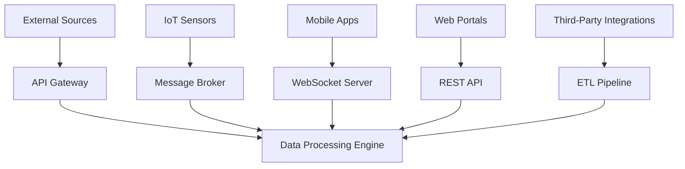
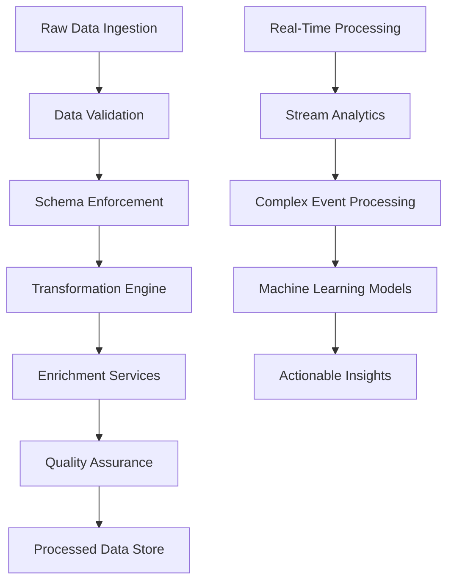
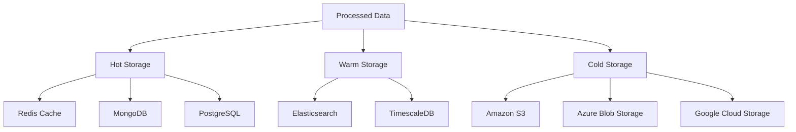
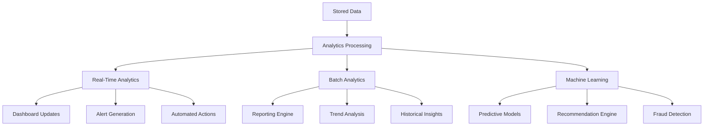
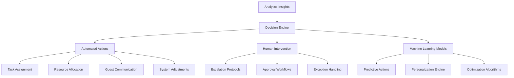

# Comprehensive Data Flow Architecture

## Overview

The Data Flow Architecture is the backbone of HotelOps, enabling seamless integration of all operational systems while ensuring real-time data processing, analytics, and automated decision-making. This architecture supports the end-to-end automation of hotel operations with zero human intervention required for daily management.

## Core Principles

### 1. Real-Time Processing
- Event-driven architecture for immediate response
- Stream processing for continuous data flow
- Microservices for scalable component deployment
- Edge computing for reduced latency

### 2. Zero Data Loss
- Redundant data pathways
- Persistent queuing systems
- Automatic failover mechanisms
- Data integrity validation at every hop

### 3. Security & Compliance
- End-to-end encryption
- Role-based access controls
- GDPR and industry compliance
- Audit trails for all data movements

### 4. Scalability & Performance
- Horizontal scaling capabilities
- Load balancing across nodes
- Caching strategies for performance
- Resource optimization algorithms

## Architecture Layers

### 1. Data Ingestion Layer


#### Ingestion Sources
1. **Guest Interaction Points**
   - Mobile applications
   - Web portals
   - In-room devices
   - Communication channels

2. **Staff Activity Monitoring**
   - Wearable devices
   - Mobile task applications
   - Biometric systems
   - Performance tracking tools

3. **Operational Systems**
   - Property management systems
   - Point-of-sale terminals
   - Maintenance management
   - Inventory tracking

4. **External Data Sources**
   - Weather services
   - Traffic and transportation
   - Competitor pricing
   - Industry benchmarks

#### Ingestion Technologies
```yaml
Real-Time Streaming:
  - Apache Kafka: High-throughput message broker
  - RabbitMQ: Reliable message queuing
  - Redis Streams: Low-latency event processing
  - AWS Kinesis: Managed streaming service

Batch Processing:
  - Apache NiFi: Data flow automation
  - Talend: ETL pipeline management
  - Informatica: Enterprise data integration
  - Custom scripts: Specialized data transformation

API Integration:
  - GraphQL: Flexible data querying
  - RESTful APIs: Standard web services
  - SOAP: Legacy system connectivity
  - Webhooks: Event-driven notifications
```

### 2. Processing & Transformation Layer


#### Data Processing Components

##### Validation & Cleansing
```python
# Sample data validation pipeline
class DataValidator:
    def __init__(self):
        self.rules = {
            'email': self.validate_email,
            'phone': self.validate_phone,
            'timestamp': self.validate_timestamp,
            'numeric': self.validate_numeric_range
        }
    
    def validate(self, data, schema):
        errors = []
        
        for field, rules in schema.items():
            if field in data:
                value = data[field]
                for rule in rules:
                    validator = self.rules.get(rule['type'])
                    if validator and not validator(value, rule.get('params')):
                        errors.append({
                            'field': field,
                            'rule': rule['type'],
                            'value': value,
                            'error': f"Validation failed for {rule['type']}"
                        })
        
        return {
            'valid': len(errors) == 0,
            'errors': errors,
            'validated_data': data if len(errors) == 0 else None
        }
    
    def validate_email(self, value, params):
        import re
        pattern = r'^[a-zA-Z0-9._%+-]+@[a-zA-Z0-9.-]+\.[a-zA-Z]{2,}$'
        return re.match(pattern, value) is not None
    
    def validate_phone(self, value, params):
        import re
        pattern = r'^\+?[\d\s\-\(\)]{10,15}$'
        return re.match(pattern, value) is not None
    
    def validate_timestamp(self, value, params):
        try:
            from datetime import datetime
            datetime.fromisoformat(value.replace('Z', '+00:00'))
            return True
        except:
            return False
    
    def validate_numeric_range(self, value, params):
        try:
            num_value = float(value)
            min_val = params.get('min', float('-inf'))
            max_val = params.get('max', float('inf'))
            return min_val <= num_value <= max_val
        except:
            return False
```

##### Transformation Engine
```javascript
// Sample data transformation system
class DataTransformer {
  constructor() {
    this.transformations = new Map();
  }

  registerTransformation(name, transformer) {
    this.transformations.set(name, transformer);
  }

  async transform(data, transformationChain) {
    let transformedData = { ...data };

    for (const transformationName of transformationChain) {
      const transformer = this.transformations.get(transformationName);
      if (transformer) {
        transformedData = await transformer(transformedData);
      }
    }

    return transformedData;
  }

  // Example transformations
  normalizeNames(data) {
    if (data.firstName) {
      data.firstName = data.firstName.charAt(0).toUpperCase() + 
                       data.firstName.slice(1).toLowerCase();
    }
    if (data.lastName) {
      data.lastName = data.lastName.charAt(0).toUpperCase() + 
                      data.lastName.slice(1).toLowerCase();
    }
    return data;
  }

  calculateDuration(data) {
    if (data.startTime && data.endTime) {
      const start = new Date(data.startTime);
      const end = new Date(data.endTime);
      data.duration = (end - start) / 1000; // Duration in seconds
    }
    return data;
  }

  enrichLocationData(data) {
    if (data.latitude && data.longitude) {
      // Enrich with location information
      data.locationInfo = {
        city: this.reverseGeocode(data.latitude, data.longitude),
        timezone: this.getTimezone(data.latitude, data.longitude),
        weather: this.getCurrentWeather(data.latitude, data.longitude)
      };
    }
    return data;
  }

  reverseGeocode(lat, lon) {
    // Simplified reverse geocoding
    return "City Name"; // Actual implementation would use geocoding service
  }

  getTimezone(lat, lon) {
    // Simplified timezone detection
    return "UTC+0"; // Actual implementation would use timezone service
  }

  getCurrentWeather(lat, lon) {
    // Simplified weather data
    return {
      temperature: 22,
      condition: "Clear",
      humidity: 65
    }; // Actual implementation would use weather API
  }
}
```

##### Machine Learning Pipeline
```python
# Sample ML processing pipeline
class MLPipeline:
    def __init__(self):
        self.models = {}
        self.feature_extractors = {}
    
    def register_model(self, name, model, feature_extractor):
        self.models[name] = model
        self.feature_extractors[name] = feature_extractor
    
    def process_batch(self, data_batch, model_name):
        if model_name not in self.models:
            raise ValueError(f"Model {model_name} not found")
        
        model = self.models[model_name]
        extractor = self.feature_extractors[model_name]
        
        # Extract features
        features = [extractor(data) for data in data_batch]
        
        # Make predictions
        predictions = model.predict(features)
        
        # Format results
        results = []
        for i, prediction in enumerate(predictions):
            results.append({
                'input_data': data_batch[i],
                'features': features[i],
                'prediction': prediction,
                'timestamp': datetime.utcnow().isoformat()
            })
        
        return results
    
    def train_model(self, model_name, training_data, labels):
        if model_name not in self.models:
            raise ValueError(f"Model {model_name} not found")
        
        model = self.models[model_name]
        extractor = self.feature_extractors[model_name]
        
        # Extract features from training data
        features = [extractor(data) for data in training_data]
        
        # Train model
        model.fit(features, labels)
        
        return model
    
    # Example feature extractors
    def extract_guest_features(self, guest_data):
        return [
            guest_data.get('previous_stays', 0),
            guest_data.get('average_spending', 0),
            len(guest_data.get('preferences', [])),
            guest_data.get('loyalty_tier', 0),
            guest_data.get('days_since_last_visit', 365)
        ]
    
    def extract_staff_features(self, staff_data):
        return [
            staff_data.get('performance_score', 0),
            staff_data.get('experience_months', 0),
            len(staff_data.get('skills', [])),
            staff_data.get('availability_today', 0),
            staff_data.get('current_workload', 0)
        ]
```

### 3. Storage Layer


#### Storage Technologies

##### Hot Storage (Real-Time Access)
```yaml
In-Memory:
  - Redis: High-speed caching and session storage
  - Memcached: Distributed memory caching
  - Apache Ignite: In-memory computing platform

Document Databases:
  - MongoDB: Flexible document storage
  - Couchbase: Distributed NoSQL database
  - Amazon DocumentDB: Managed MongoDB-compatible service

Relational Databases:
  - PostgreSQL: Advanced open-source database
  - MySQL: Popular open-source database
  - Amazon Aurora: Managed MySQL/PostgreSQL compatible service
```

##### Warm Storage (Frequent Access)
```yaml
Time-Series:
  - TimescaleDB: PostgreSQL extension for time-series data
  - InfluxDB: Purpose-built time-series database
  - Prometheus: Monitoring and alerting toolkit

Search Engines:
  - Elasticsearch: Distributed search and analytics engine
  - Solr: Enterprise search platform
  - OpenSearch: Community-driven fork of Elasticsearch

Graph Databases:
  - Neo4j: Leading graph database
  - Amazon Neptune: Managed graph database service
  - ArangoDB: Multi-model database
```

##### Cold Storage (Archival)
```yaml
Object Storage:
  - Amazon S3: Scalable object storage
  - Google Cloud Storage: Unified object storage
  - Azure Blob Storage: Massively scalable object storage

Data Warehouses:
  - Snowflake: Cloud-native data platform
  - Amazon Redshift: Petabyte-scale data warehouse
  - Google BigQuery: Serverless, highly scalable data warehouse

Data Lakes:
  - Delta Lake: Storage layer for reliable data lakes
  - Apache Iceberg: High-performance table format
  - Hudi: Incremental data processing framework
```

### 4. Analytics & Intelligence Layer


#### Analytics Processing

##### Real-Time Analytics
```python
# Sample real-time analytics processor
class RealTimeAnalytics:
    def __init__(self):
        self.metrics = {}
        self.alerts = []
    
    def process_event(self, event):
        # Update metrics
        self.update_metrics(event)
        
        # Check for alerts
        self.check_alerts(event)
        
        # Generate insights
        insights = self.generate_insights(event)
        
        # Trigger actions
        self.trigger_actions(insights)
        
        return insights
    
    def update_metrics(self, event):
        event_type = event.get('type')
        if event_type not in self.metrics:
            self.metrics[event_type] = {
                'count': 0,
                'sum': 0,
                'avg': 0,
                'min': float('inf'),
                'max': float('-inf')
            }
        
        metric = self.metrics[event_type]
        value = event.get('value', 0)
        
        metric['count'] += 1
        metric['sum'] += value
        metric['avg'] = metric['sum'] / metric['count']
        metric['min'] = min(metric['min'], value)
        metric['max'] = max(metric['max'], value)
    
    def check_alerts(self, event):
        # Check for threshold violations
        thresholds = {
            'high_priority_task': 10,
            'guest_complaint': 5,
            'system_error': 1
        }
        
        event_type = event.get('type')
        if event_type in thresholds:
            current_count = self.metrics.get(event_type, {}).get('count', 0)
            if current_count >= thresholds[event_type]:
                self.create_alert(event_type, current_count)
    
    def create_alert(self, event_type, count):
        alert = {
            'type': 'threshold_violation',
            'event_type': event_type,
            'count': count,
            'severity': 'high' if count > thresholds[event_type] * 2 else 'medium',
            'timestamp': datetime.utcnow().isoformat()
        }
        self.alerts.append(alert)
        self.send_alert_notification(alert)
    
    def generate_insights(self, event):
        insights = []
        
        # Pattern detection
        if self.detect_pattern(event):
            insights.append({
                'type': 'pattern_detected',
                'description': 'Recurring pattern identified',
                'confidence': 0.85,
                'timestamp': datetime.utcnow().isoformat()
            })
        
        # Anomaly detection
        if self.detect_anomaly(event):
            insights.append({
                'type': 'anomaly_detected',
                'description': 'Unusual activity detected',
                'confidence': 0.92,
                'timestamp': datetime.utcnow().isoformat()
            })
        
        return insights
    
    def detect_pattern(self, event):
        # Simplified pattern detection
        return False  # Actual implementation would use ML models
    
    def detect_anomaly(self, event):
        # Simplified anomaly detection
        return False  # Actual implementation would use statistical methods
    
    def trigger_actions(self, insights):
        for insight in insights:
            if insight['type'] == 'pattern_detected':
                self.optimize_process(insight)
            elif insight['type'] == 'anomaly_detected':
                self.investigate_anomaly(insight)
    
    def optimize_process(self, insight):
        # Implementation for process optimization
        pass
    
    def investigate_anomaly(self, insight):
        # Implementation for anomaly investigation
        pass
    
    def send_alert_notification(self, alert):
        # Implementation for sending alert notifications
        print(f"ALERT: {alert['event_type']} count: {alert['count']}")
```

##### Batch Analytics
```python
# Sample batch analytics processor
class BatchAnalytics:
    def __init__(self):
        self.report_templates = {}
        self.scheduled_jobs = []
    
    def schedule_report(self, report_name, template, schedule):
        job = {
            'name': report_name,
            'template': template,
            'schedule': schedule,
            'last_run': None,
            'next_run': self.calculate_next_run(schedule)
        }
        self.scheduled_jobs.append(job)
    
    def run_scheduled_reports(self):
        now = datetime.utcnow()
        for job in self.scheduled_jobs:
            if job['next_run'] <= now:
                self.generate_report(job)
                job['last_run'] = now
                job['next_run'] = self.calculate_next_run(job['schedule'])
    
    def generate_report(self, job):
        # Generate report based on template
        data = self.fetch_report_data(job['template']['data_source'])
        processed_data = self.process_report_data(data, job['template'])
        report = self.format_report(processed_data, job['template'])
        
        # Distribute report
        self.distribute_report(report, job['template']['recipients'])
        
        return report
    
    def fetch_report_data(self, data_source):
        # Implementation for fetching data from various sources
        return {}  # Simplified
    
    def process_report_data(self, data, template):
        # Process data according to template specifications
        return data  # Simplified
    
    def format_report(self, data, template):
        # Format data into final report
        return {
            'title': template.get('title', 'Report'),
            'generated_at': datetime.utcnow().isoformat(),
            'data': data
        }
    
    def distribute_report(self, report, recipients):
        # Distribute report to recipients
        for recipient in recipients:
            self.send_report(recipient, report)
    
    def send_report(self, recipient, report):
        # Implementation for sending report
        print(f"Sending report to {recipient}")
    
    def calculate_next_run(self, schedule):
        # Calculate next run time based on schedule
        return datetime.utcnow() + timedelta(hours=1)  # Simplified
```

### 5. Action & Automation Layer


#### Decision Engine
```python
# Sample decision engine
class DecisionEngine:
    def __init__(self):
        self.rules = {}
        self.models = {}
        self.actions = {}
    
    def register_rule(self, name, condition, action):
        self.rules[name] = {
            'condition': condition,
            'action': action
        }
    
    def register_model(self, name, model, action_generator):
        self.models[name] = {
            'model': model,
            'action_generator': action_generator
        }
    
    def register_action(self, name, action):
        self.actions[name] = action
    
    def process_insight(self, insight):
        # Apply rules
        rule_actions = self.apply_rules(insight)
        
        # Apply models
        model_actions = self.apply_models(insight)
        
        # Combine and prioritize actions
        all_actions = rule_actions + model_actions
        prioritized_actions = self.prioritize_actions(all_actions)
        
        # Execute actions
        results = []
        for action in prioritized_actions:
            result = self.execute_action(action)
            results.append(result)
        
        return results
    
    def apply_rules(self, insight):
        actions = []
        for name, rule in self.rules.items():
            if rule['condition'](insight):
                action = rule['action'](insight)
                actions.append(action)
        return actions
    
    def apply_models(self, insight):
        actions = []
        for name, model_info in self.models.items():
            prediction = model_info['model'].predict(insight)
            action = model_info['action_generator'](prediction)
            actions.append(action)
        return actions
    
    def prioritize_actions(self, actions):
        # Prioritize actions based on urgency, impact, and dependencies
        return sorted(actions, key=lambda a: a.get('priority', 0), reverse=True)
    
    def execute_action(self, action):
        action_func = self.actions.get(action['type'])
        if action_func:
            return action_func(action['params'])
        else:
            raise ValueError(f"Unknown action type: {action['type']}")
    
    # Example rules
    def register_default_rules(self):
        self.register_rule(
            'high_priority_task',
            lambda insight: insight.get('priority') == 'high',
            lambda insight: {'type': 'escalate_issue', 'params': insight}
        )
        
        self.register_rule(
            'guest_satisfaction_drop',
            lambda insight: insight.get('satisfaction_score', 1.0) < 0.5,
            lambda insight: {'type': 'guest_recovery', 'params': insight}
        )
    
    # Example models
    def register_default_models(self):
        # Simplified model registration
        pass
    
    # Example actions
    def register_default_actions(self):
        self.actions['escalate_issue'] = self.escalate_issue
        self.actions['guest_recovery'] = self.guest_recovery
        self.actions['optimize_schedule'] = self.optimize_schedule
    
    def escalate_issue(self, params):
        # Implementation for escalating issues
        print(f"Escalating issue: {params}")
        return {'status': 'success', 'action': 'escalate_issue'}
    
    def guest_recovery(self, params):
        # Implementation for guest recovery actions
        print(f"Initiating guest recovery: {params}")
        return {'status': 'success', 'action': 'guest_recovery'}
    
    def optimize_schedule(self, params):
        # Implementation for schedule optimization
        print(f"Optimizing schedule: {params}")
        return {'status': 'success', 'action': 'optimize_schedule'}
```

## Data Security & Compliance

### Encryption Standards
```yaml
Data at Rest:
  - AES-256: Advanced Encryption Standard
  - RSA-4096: Asymmetric encryption for key management
  - Hardware Security Modules (HSM): Physical security for encryption keys

Data in Transit:
  - TLS 1.3: Latest transport layer security
  - Mutual TLS: Certificate-based authentication
  - Perfect Forward Secrecy: Key rotation for session security

Key Management:
  - HashiCorp Vault: Secrets management
  - AWS KMS: Managed key service
  - Azure Key Vault: Cloud-based key management
```

### Access Control
```python
# Sample access control system
class AccessControl:
    def __init__(self):
        self.roles = {}
        self.permissions = {}
        self.user_roles = {}
    
    def define_role(self, role_name, permissions):
        self.roles[role_name] = permissions
    
    def assign_role(self, user_id, role_name):
        if role_name in self.roles:
            if user_id not in self.user_roles:
                self.user_roles[user_id] = []
            self.user_roles[user_id].append(role_name)
    
    def check_permission(self, user_id, resource, action):
        user_roles = self.user_roles.get(user_id, [])
        
        for role in user_roles:
            role_permissions = self.roles.get(role, [])
            if f"{resource}:{action}" in role_permissions:
                return True
        
        return False
    
    def enforce_access(self, user_id, resource, action):
        if not self.check_permission(user_id, resource, action):
            raise PermissionError(f"Access denied: {user_id} cannot {action} {resource}")
    
    # Example role definitions
    def setup_default_roles(self):
        self.define_role('guest', [
            'profile:view',
            'booking:create',
            'feedback:create'
        ])
        
        self.define_role('staff', [
            'tasks:view',
            'tasks:update',
            'guest_communication:create',
            'reports:view'
        ])
        
        self.define_role('manager', [
            'staff_management:*',
            'reports:*',
            'settings:*',
            'analytics:*'
        ])
        
        self.define_role('admin', [
            '*:*'
        ])
```

### Compliance Framework
```python
# Sample compliance monitoring
class ComplianceMonitor:
    def __init__(self):
        self.regulations = {}
        self.audit_trails = []
    
    def register_regulation(self, name, requirements):
        self.regulations[name] = requirements
    
    def check_compliance(self, data_operation):
        violations = []
        
        for reg_name, requirements in self.regulations.items():
            for requirement in requirements:
                if not self.check_requirement(requirement, data_operation):
                    violations.append({
                        'regulation': reg_name,
                        'requirement': requirement,
                        'violation': data_operation
                    })
        
        return violations
    
    def check_requirement(self, requirement, operation):
        # Implementation for checking specific requirements
        return True  # Simplified
    
    def log_operation(self, operation):
        audit_entry = {
            'operation': operation,
            'timestamp': datetime.utcnow().isoformat(),
            'compliance_check': self.check_compliance(operation)
        }
        self.audit_trails.append(audit_entry)
        
        # Alert on violations
        if audit_entry['compliance_check']:
            self.alert_violation(audit_entry)
    
    def alert_violation(self, audit_entry):
        # Implementation for violation alerts
        print(f"COMPLIANCE VIOLATION: {audit_entry}")
```

## Monitoring & Observability

### System Health Monitoring
```yaml
Infrastructure:
  - CPU/Memory/Disk usage
  - Network throughput and latency
  - Database connection pools
  - Message queue depths

Application:
  - API response times
  - Error rates and exceptions
  - Transaction throughput
  - Cache hit/miss ratios

Business Metrics:
  - Guest satisfaction scores
  - Staff productivity metrics
  - Revenue per available room
  - Operational efficiency indicators
```

### Logging Framework
```python
# Sample logging system
import logging
import json
from datetime import datetime

class StructuredLogger:
    def __init__(self, name):
        self.logger = logging.getLogger(name)
        self.logger.setLevel(logging.INFO)
        
        # Add handler for structured logging
        handler = logging.StreamHandler()
        formatter = logging.Formatter('%(message)s')
        handler.setFormatter(formatter)
        self.logger.addHandler(handler)
    
    def log_event(self, event_type, **kwargs):
        log_entry = {
            'timestamp': datetime.utcnow().isoformat(),
            'event_type': event_type,
            'data': kwargs,
            'level': 'INFO'
        }
        self.logger.info(json.dumps(log_entry))
    
    def log_error(self, error_type, error_message, **kwargs):
        log_entry = {
            'timestamp': datetime.utcnow().isoformat(),
            'event_type': 'ERROR',
            'error_type': error_type,
            'error_message': error_message,
            'data': kwargs,
            'level': 'ERROR'
        }
        self.logger.error(json.dumps(log_entry))
    
    def log_metric(self, metric_name, value, **kwargs):
        log_entry = {
            'timestamp': datetime.utcnow().isoformat(),
            'event_type': 'METRIC',
            'metric_name': metric_name,
            'value': value,
            'data': kwargs,
            'level': 'INFO'
        }
        self.logger.info(json.dumps(log_entry))

# Usage example
logger = StructuredLogger('hotel_ops')

# Log business events
logger.log_event('guest_checkin', 
                 guest_id='GUEST-123',
                 room_number='205',
                 checkin_time=datetime.utcnow().isoformat())

# Log system metrics
logger.log_metric('api_response_time', 
                  150,  # milliseconds
                  endpoint='/api/guest/checkin',
                  method='POST')

# Log errors
logger.log_error('database_connection_failed',
                 'Failed to connect to guest database',
                 retry_attempt=3,
                 error_code='DB_CONN_001')
```

## Disaster Recovery & Business Continuity

### Backup Strategies
```yaml
Real-Time Replication:
  - Database replication: Master-slave or multi-master
  - Message queue mirroring: Across availability zones
  - File system synchronization: Continuous backup streams

Scheduled Backups:
  - Full system snapshots: Daily at low-traffic periods
  - Incremental backups: Hourly differential changes
  - Configuration backups: Version-controlled system settings

Geographic Distribution:
  - Multi-region deployment: Active-active or active-passive
  - Cross-cloud redundancy: Multiple cloud provider storage
  - Edge caching: Content delivery network for static assets
```

### Recovery Procedures
```python
# Sample disaster recovery system
class DisasterRecovery:
    def __init__(self):
        self.backup_locations = []
        self.recovery_plans = {}
        self.health_checks = []
    
    def add_backup_location(self, location):
        self.backup_locations.append(location)
    
    def define_recovery_plan(self, scenario, plan):
        self.recovery_plans[scenario] = plan
    
    def execute_recovery(self, scenario):
        if scenario not in self.recovery_plans:
            raise ValueError(f"No recovery plan for scenario: {scenario}")
        
        plan = self.recovery_plans[scenario]
        
        # Execute recovery steps
        for step in plan['steps']:
            self.execute_step(step)
        
        # Verify recovery
        self.verify_recovery(plan['verification'])
    
    def execute_step(self, step):
        # Implementation for executing recovery step
        print(f"Executing recovery step: {step['name']}")
        
        if step['type'] == 'restore_database':
            self.restore_database(step['backup_location'])
        elif step['type'] == 'restart_services':
            self.restart_services(step['services'])
        elif step['type'] == 'redirect_traffic':
            self.redirect_traffic(step['target'])
    
    def restore_database(self, backup_location):
        # Implementation for database restoration
        print(f"Restoring database from {backup_location}")
    
    def restart_services(self, services):
        # Implementation for service restart
        print(f"Restarting services: {services}")
    
    def redirect_traffic(self, target):
        # Implementation for traffic redirection
        print(f"Redirecting traffic to {target}")
    
    def verify_recovery(self, verification_steps):
        # Implementation for recovery verification
        for step in verification_steps:
            print(f"Verifying: {step}")
    
    def health_check(self):
        # Implementation for system health monitoring
        health_status = {
            'database': self.check_database_health(),
            'services': self.check_service_health(),
            'network': self.check_network_health(),
            'storage': self.check_storage_health()
        }
        return health_status
    
    def check_database_health(self):
        # Implementation for database health check
        return {'status': 'healthy', 'response_time': 15}  # ms
    
    def check_service_health(self):
        # Implementation for service health check
        return {'status': 'healthy', 'uptime': '99.99%'}
    
    def check_network_health(self):
        # Implementation for network health check
        return {'status': 'healthy', 'latency': 25}  # ms
    
    def check_storage_health(self):
        # Implementation for storage health check
        return {'status': 'healthy', 'utilization': '65%'}
```

## Performance Optimization

### Caching Strategy
```python
# Sample caching system
class CacheManager:
    def __init__(self):
        self.cache_layers = {
            'l1': {},  # In-memory (Redis/Memcached)
            'l2': {},  # Local disk cache
            'l3': {}   # Distributed cache
        }
        self.cache_policies = {}
    
    def set(self, key, value, ttl=None, layer='l1'):
        expiration = None
        if ttl:
            expiration = datetime.utcnow() + timedelta(seconds=ttl)
        
        cache_entry = {
            'value': value,
            'expiration': expiration,
            'created': datetime.utcnow()
        }
        
        self.cache_layers[layer][key] = cache_entry
    
    def get(self, key, layer='l1'):
        cache_entry = self.cache_layers[layer].get(key)
        if not cache_entry:
            return None
        
        # Check expiration
        if cache_entry['expiration'] and cache_entry['expiration'] < datetime.utcnow():
            del self.cache_layers[layer][key]
            return None
        
        return cache_entry['value']
    
    def invalidate(self, key, layer='l1'):
        if key in self.cache_layers[layer]:
            del self.cache_layers[layer][key]
    
    def clear_layer(self, layer):
        self.cache_layers[layer].clear()
    
    def set_policy(self, pattern, policy):
        self.cache_policies[pattern] = policy
    
    def get_cache_key(self, *args, **kwargs):
        # Generate cache key from function arguments
        key_parts = []
        for arg in args:
            key_parts.append(str(arg))
        for key, value in kwargs.items():
            key_parts.append(f"{key}={value}")
        return ":".join(key_parts)

# Usage example
cache = CacheManager()

# Cache expensive operations
def get_guest_preferences(guest_id):
    cache_key = cache.get_cache_key('guest_preferences', guest_id)
    cached_result = cache.get(cache_key)
    if cached_result:
        return cached_result
    
    # Expensive database query
    result = expensive_database_query(guest_id)
    
    # Cache result for 1 hour
    cache.set(cache_key, result, ttl=3600)
    return result
```

### Load Balancing
```python
# Sample load balancer
class LoadBalancer:
    def __init__(self):
        self.servers = []
        self.algorithm = 'round_robin'
        self.current_index = 0
    
    def add_server(self, server_info):
        self.servers.append({
            'info': server_info,
            'health': 'healthy',
            'load': 0,
            'requests_handled': 0
        })
    
    def remove_server(self, server_id):
        self.servers = [s for s in self.servers if s['info']['id'] != server_id]
    
    def select_server(self, request):
        healthy_servers = [s for s in self.servers if s['health'] == 'healthy']
        if not healthy_servers:
            raise Exception("No healthy servers available")
        
        if self.algorithm == 'round_robin':
            return self.round_robin_select(healthy_servers)
        elif self.algorithm == 'least_connections':
            return self.least_connections_select(healthy_servers)
        elif self.algorithm == 'weighted_round_robin':
            return self.weighted_round_robin_select(healthy_servers)
        else:
            return healthy_servers[0]  # Fallback to first available
    
    def round_robin_select(self, servers):
        selected = servers[self.current_index]
        self.current_index = (self.current_index + 1) % len(servers)
        selected['requests_handled'] += 1
        return selected
    
    def least_connections_select(self, servers):
        selected = min(servers, key=lambda s: s['load'])
        selected['load'] += 1
        return selected
    
    def weighted_round_robin_select(self, servers):
        # Implementation for weighted round robin selection
        # Servers with higher weights get more requests
        total_weight = sum(s['info'].get('weight', 1) for s in servers)
        # Simplified selection logic
        return servers[0]
    
    def update_server_health(self, server_id, health_status):
        for server in self.servers:
            if server['info']['id'] == server_id:
                server['health'] = health_status
                break
    
    def update_server_load(self, server_id, load_delta):
        for server in self.servers:
            if server['info']['id'] == server_id:
                server['load'] += load_delta
                break

# Usage example
lb = LoadBalancer()
lb.add_server({'id': 'web-01', 'weight': 2})
lb.add_server({'id': 'web-02', 'weight': 1})
lb.add_server({'id': 'web-03', 'weight': 3})

selected_server = lb.select_server({'endpoint': '/api/guest/profile'})
print(f"Selected server: {selected_server['info']['id']}")
```

## Conclusion

The Comprehensive Data Flow Architecture ensures seamless integration of all HotelOps components while providing the scalability, security, and performance required for enterprise-grade operations. Through real-time processing, intelligent analytics, and automated decision-making, this architecture enables hotels to achieve unprecedented levels of operational efficiency and guest satisfaction.

The modular design allows for gradual implementation and easy scaling, while the robust security framework ensures compliance with all relevant regulations. The combination of hot, warm, and cold storage strategies optimizes both performance and cost, while comprehensive monitoring and disaster recovery capabilities ensure system reliability.

This architecture forms the foundation for truly autonomous hotel operations, where data flows seamlessly between systems to enable intelligent automation and continuous improvement.